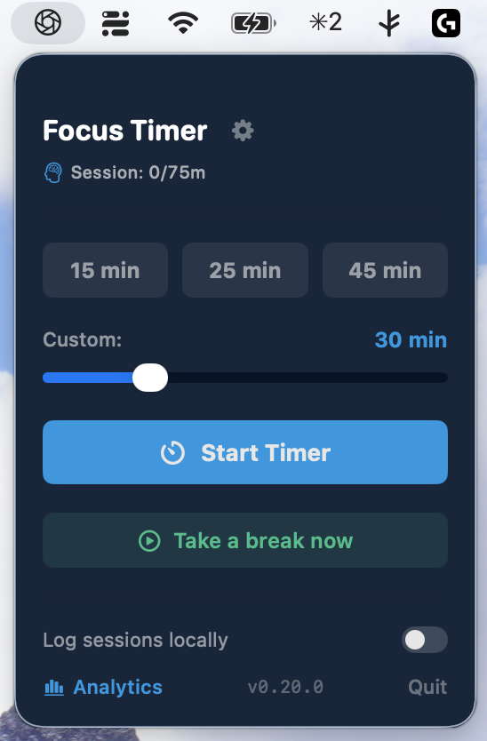
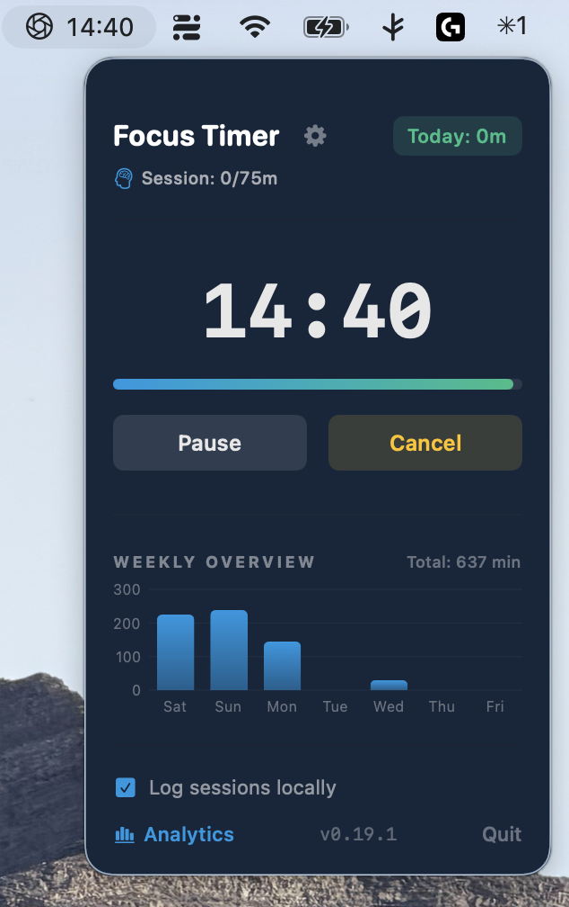
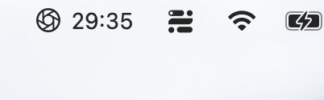

# FocusTimer for macOS

> **Neuroscience-based focus and microbreak management designed for sustainable deep work.**

---

## 🎯 What is FocusTimer?

**FocusTimer** is a lightweight, native macOS menu bar application engineered to integrate evidence-based cognitive neuroscience into your daily workflow. It prevents mental fatigue by aligning deep work intervals with autonomic nervous system recovery.

  
  &nbsp;&nbsp;
  

  

Choose a duration · a running focus block with your weekly overview · the countdown in the menu bar

### Key Capabilities:
* ⏱️ **Distraction-Free Focus Blocks:** Customizable timer durations (25 minutes by default) with a subtle menu bar readout and a floating countdown in the final minute — in a colour of your choosing.
* 🧠 **Science-Backed Microbreaks:** Recovery is offered automatically once continuous focus passes a threshold you set, 75 minutes by default.
* 🌬️ **Guided Breathing Protocols:** Parasympathetic activation through **Balance (Coherence)**, **Focus (Box Breathing)**, and **Slow Down (Focus Pause)**. The circle fills the screen and shifts colour with your breath, and every phase — including the holds — has its own tone, so an exercise can be followed with the eyes closed.
* 🫶 **Bilateral Stimulation:** Cross your arms and tap left and right in turn, in time with alternating tones at 60 BPM.
* 🤸 **Standing Stretch:** Stand up, then loosen shoulders, chest and neck in a short fixed sequence — the one exercise that gets you out of the chair.
* 🪟 **Window Gaze:** Look out of the window for ninety seconds and search for one thing you have never noticed before — a short break for the eyes and for the attention.
* 🌙 **Screen-Free Breaks:** A guided five-minute pause that asks you to look away from the display entirely.
* 📊 **On-Device Analytics:** Daily focus-to-break ratio tracking and hourly distribution charts with one-click CSV export.
* 🔔 **A Reminder to Start One:** After half an hour at the Mac without a focus block, a small offer appears in the corner — at most once in the morning and once in the afternoon, never outside working hours, and switchable off.
* 🚀 **Starts With Your Session:** Optionally launches at login — a menu bar app that is not running cannot remind you of anything.

---

## 🚀 Download & Installation

### ⬇️ [Direct Download Latest Version (FocusTimer.dmg)](https://github.com/DrAndreasEisele/FocusTimer_release/releases/latest/download/FocusTimer.dmg)

*You can also explore detailed release notes in the **[Releases Section](https://github.com/DrAndreasEisele/FocusTimer_release/releases)**.*

### Quick Setup:
1. Download **`FocusTimer.dmg`** using the direct link above.
2. Open the disk image and drag **FocusTimer.app** into your **Applications** folder.
3. Launch **FocusTimer** from Applications or Spotlight.

> [!TIP]
> **Seamless In-App Updates:** Once installed, FocusTimer checks for new versions once a day, at 10 am, and installs them in seconds with a single click. You can turn the check off under **Settings › System & Updates**.

### Can't See the Icon? A Full Menu Bar Hides It

FocusTimer lives in the menu bar, and macOS gives that bar a fixed amount of room. On a
MacBook Air without an external display it fills up quickly — and when it does, macOS hides
the icons that no longer fit, without saying so. The app is running; you just cannot see it.
Two things fix it, both take a minute:

1. **Make room.** **System Settings › Menu Bar** lists everything allowed to sit up there,
   including every third-party app. Set the ones you never use to *Don't Show in Menu Bar*.
   This is the fix that actually works, because it addresses the cause. (On macOS versions
   before 26 the same pane is called **Control Center**.)
2. **Move FocusTimer to safety.** Hold **⌘** and drag an icon along the menu bar to reorder
   it. When space runs short, the icons on the **left** disappear first, so drag FocusTimer
   **right**, towards the clock. This works only while you can still see it.

And if the icon is already gone, or you quit the app by mistake: **search for FocusTimer in
Spotlight and open it.** It is very likely still running, and opening it again brings up a
window with the same controls the menu shows. While that window is open the app also appears
in the dock — right-click the icon and choose **Options › Keep in Dock**, and you have a
permanent way in that no longer depends on the menu bar at all.

---

## 🛡️ Privacy & GDPR Compliance (Privacy by Design)

* **On-Device Processing:** All timer statistics, break records and preferences remain on your local Mac. There is no account, no server and no profiling.
* **No Telemetry, No Tracking:** No analytics, no keylogging, no advertising identifiers, no behavioural data of any kind.
* **Presence, Not Activity:** The reminder to start a focus block asks macOS one question — *how many seconds since the last input* — and compares the answer on the spot. No key, click or window title is read, no permission is required, nothing is stored and nothing is sent. It can be switched off under **Settings › Focus**.
* **One Outbound Connection — the Update Check:** Once a day, at 10 am, the app asks GitHub whether a newer version exists. Like any web request this transmits your IP address to GitHub, and nothing else. It can be switched off under **Settings › System & Updates**, at the cost of no longer being offered updates. The app states this itself in a notice on first launch.
* **Complete Data Ownership:** Instant local CSV export and a full reset are always available.

---

## 🔒 Security & Verification

* **Officially Notarized by Apple:** Signed with a valid Developer ID (`Developer ID Application: Andreas Franz Eisele`) and validated by Apple's Notary Service for Gatekeeper security.
* **Cryptographic Signatures:** In-app updates are verified against Ed25519 public key signatures to ensure binary integrity.

---

## 🙏 Credits

* The moon shown in the breathing exercise is rendered from NASA's
  [CGI Moon Kit](https://svs.gsfc.nasa.gov/4720/) — surface colour and elevation measured by the
  Lunar Reconnaissance Orbiter, published by the Scientific Visualization Studio. NASA material
  is in the public domain; NASA does not endorse this app.

## 📋 System Requirements

* **Operating System:** macOS 26.1 (Tahoe) or later
* **Hardware:** Universal Binary (Apple Silicon & Intel processors)

---

## ⚖️ License & Terms of Use

FocusTimer is distributed as proprietary freeware for personal and professional evaluation.

* **Grant of License:** You are granted a non-exclusive, non-transferable, revocable license to use the application free of charge on your Apple devices.
* **Restrictions:** You may not decompile, reverse-engineer, modify, redistribute for commercial sale, or create derivative works without prior written consent.
* **Disclaimer of Warranty & Limitation of Liability:** The software is provided "AS IS", without warranty of any kind, express or implied. In no event shall the author be liable for any claims, damages, or liabilities arising from its use.
* **Health & Wellness Disclaimer:** FocusTimer offers mindfulness and breathing exercises intended solely for general relaxation, productivity, and stress awareness. It is not a medical device and does not substitute for professional medical advice, diagnosis, or treatment.
* **Copyright:** © 2026 Dr. Andreas Eisele. All rights reserved.

---

## 📬 Feedback & Support

For feedback, feature requests, or inquiries, please open an issue in this repository or contact Dr. Andreas Eisele.
